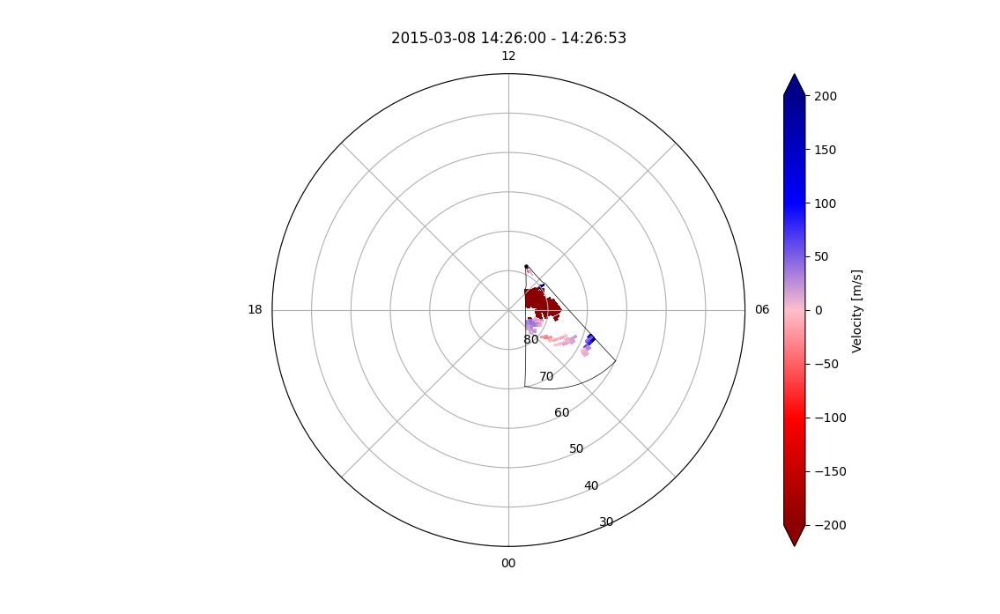
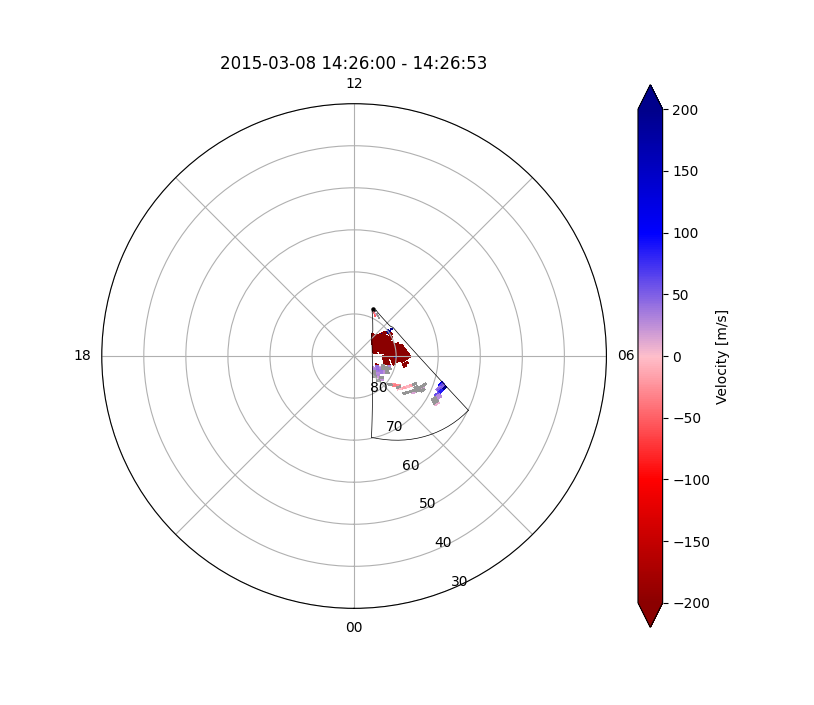

<!--Copyright (C) SuperDARN Canada, University of Saskatchewan 
Author(s): Daniel Billet 
Modifications:
20210922: CJM - included info on new channel option
20220912: CJM - Updated for new changes

Disclaimer:
pyDARN is under the LGPL v3 license found in the root directory LICENSE.md 
Everyone is permitted to copy and distribute verbatim copies of this license 
document, but changing it is not allowed.

This version of the GNU Lesser General Public License incorporates the terms
and conditions of version 3 of the GNU General Public License, supplemented by
the additional permissions listed below.
-->

# Fan plots
---

Fan plots are a way to visualise data from the entire scan of a SuperDARN radar. 

All beams and ranges for a given parameter (such as line-of-sight velocity, backscatter power, etc) and a particular scan can be projected onto a polar format plot in [AACGMv2](http://superdarn.thayer.dartmouth.edu/aacgm.html) coordinates, or projected onto a geographic plot in geographic coordinates.

!!! Warning 
    AACGM coordinates cannot be plotted on a geographic projection.

The mapping of the range gate corners was based on [rbpos in RST](https://github.com/SuperDARN/rst/blob/0aa1fffed4cc48c1eb6372dfc9effa688af95624/codebase/superdarn/src.idl/lib/legacy.1.6/rbposlib.pro) that is coded in `/pydarn/geo.py`. To get the coordinates read [hardware docs](hardware.md).

### Basic usage
pyDARN and pyplot need to be imported, as well as any FITACF file needs to be [read in](https://pydarn.readthedocs.io/en/latest/user/SDarnRead/):

```python
import matplotlib.pyplot as plt
import pydarn

#Read in fitACF file using SuperDARDRead, then read_fitacf
file = "path/to/fitacf/file"
SDarn_read = pydarn.SuperDARNRead(file)
fitacf_data = SDarn_read.read_fitacf()

```
With the FITACF data loaded as a list of dictionaries (`fitacf_data` variable in above example), you may now call the `plot_fan` method. Make sure you tell it which scan (numbered from first recorded scan in file, counting from 1 or give it a `datetime` object for the scan at that time) you want using `scan_index`:
```python
fanplot = pydarn.Fan.plot_fan(fitacf_data, scan_index=27, 
                              colorbar_label='Velocity [m/s]')
plt.show()
```
In this example, the 27th scan was plotted with the defaulted parameter being line-of-sight velocity:


You can also provide a `datetime` object to obtain a scan at a specific time: 
```python
pydarn.Fan.plot_fan(cly_data, scan_index=datetime(2015, 3, 8, 15, 26),
                     colorbar_label='Velocity [m/s]')
```


!!! Warning
    Do not include seconds, typically scans are 1 minute long so seconds may end in a error with no data. 

Default plots also do not show groundscatter as grey. Set it to true to colour groundscatter:

```python
fanplot = pydarn.Fan.plot_fan(fitacf_data,
                              scan_index=27,
                              groundscatter=True)
plt.show()

```


You might have noticed that the variable `fanplot` in the examples above actually holds some information. This contains the AACGM latitude and longitude of the fan just plotted, as well as the data, ground scatter information, and datetime object. If you instead change `fanplot` to 5 separate variables, it will return the latitude, longitude, data, groundscatter and datetime info into seperate variables:
```python
ax, lats, lons, data, grndsct = pydarn.Fan.plot_fan(fitacf_data,
                                                    scan_index=27)

lats.shape

```
Which returns `>>>(76, 17)`, i.e. ranges x beams array of the latitude, and so on for the other variables. The groundscatter array is 0's and 1's, 1 being a range gate flagged as groundscatter.

### Additional parameters

In addition to line-of-sight velocity, you can choose one of three other data products to plot by setting `parameter=String name`:

| Data product                          | String name |
|---------------------------------------|-------------|
| Line of sight velocity (m/s) [Default]| 'v'         |
| Spectral width (m/s)                  | 'w_l'       |
| Elevation angle (degrees)             | 'elv'       |
| Power (dB)                            | 'p_l'       |

### Additional options

Here is a list of all the current options than can be used with `plot_fan`

| Option                        | Action                                                                                                  |
| ----------------------------- | ------------------------------------------------------------------------------------------------------- |
| ax=(Axes Object)              | Matplotlib axes object than can be used for cartopy additions                                           |
| scan_index=(int or  datetime) | Scan number or datetime, from start of records in file corresponding to channel if given                |
| channel=(int or 'all')        | Specify channel number or choose 'all' (default = 'all')                                                |
| parameter=(string)            | See above table for options                                                                             |
| groundscatter=(bool)          | True or false to showing ground scatter as grey                                                         |
| ranges=(list)                 | Two element list giving the lower and upper ranges to plot, grabs ranges from hardware file (default [] |
| cmap=string                   | A matplotlib color map string                                                                           |
| grid=(bool)                   | Boolean to apply the grid lay of the FOV (default: False )                                              |
| zmin=(int)                    | Minimum data value for colouring                                                                        |
| zmax=(int)                    | Maximum data value for colouring                                                                        |
| colorbar=(bool)               | Set true to plot a colorbar (default: True)                                                             |
| colorbar_label=(string)       | Label for the colour bar (requires colorbar to be true)                                                 |
| title=(string)                | Title for the fan plot, default auto generated one based on input information                           |
| boundary=(bool)               | Set false to not show the outline of the radar FOV (default: True)                                      |
| coords=(Coords)               | [Coordinates](coordinates.md) for the data to be plotted in                                             |
| projs=(Projs)                 | Projections to plot the data on top of                                                                  |
| colorbar_label=(string)       | Label that appears next to the color bar, requires colorbar to be True                                  |
| coastline=(bool)              | Plots outlines of coastlines below data (Uses Cartopy)                                                  |
| kwargs **                     | Axis Polar settings. See [polar axis](axis.md)                                                          |


!!! Note
    For some control programs, the user may need to specify a channel integer as `'all'` will not correctly show the data.
    In other cases, the user may want to specify the channel and use an integer (N) for the `scan_index`. Be aware that this will show the
    data for the Nth scan of only the chosen channel, not that of the entire file. 

`plot_fan` can concatenate with itself in both polar and geographic projectsion, here is an example of plotting two different radars with some of the above parameters:

```python
import pydarn
from datetime import datetime
import matplotlib.pyplot as plt 

cly_file = 'data/20150308.1400.03.cly.fitacf'
pyk_file = 'data/20150308.1401.00.pyk.fitacf'

pyk_data = pydarn.SuperDARNRead().read_dmap(pyk_file)
cly_data = pydarn.SuperDARNRead().read_dmap(cly_file)

pydarn.Fan.plot_fan(cly_data, scan_index=datetime(2015, 3, 8, 14, 4),
                    colorbar=False, fov_color='grey', line_color='blue',
                    radar_label=True)

pydarn.Fan.plot_fan(pyk_data, scan_index=datetime(2015, 3, 8, 14, 4), 
                    colorbar_label='Velocity [m/s]', fov_color='grey',
                    line_color='red', radar_label=True)

plt.show()
```


Using *cartopy* to plot underlaid coastline map using the `coastline` keyword:

```python
ax, _, _, _, _ = pydarn.Fan.plot_fan(data, scan_index=5, radar_label=True,
                                     groundscatter=True,
                                     coords=pydarn.Coords.GEOGRAPHIC,
                                     projs=pydarn.Projs.GEO,
                                     colorbar_label="Velocity m/s",
                                     coastline=True)
plt.show()
``` 


