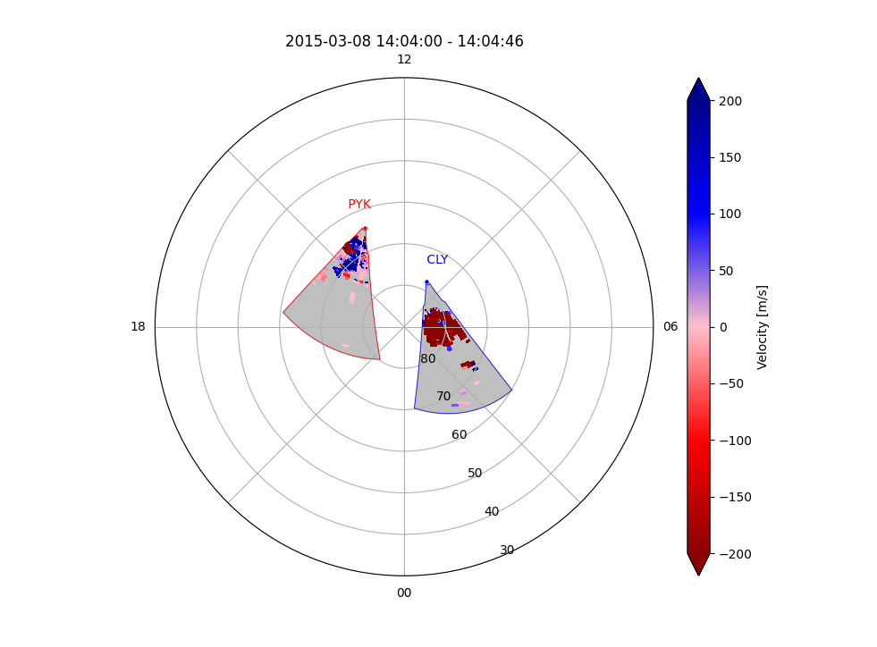

<!--Copyright (C) SuperDARN Canada, University of Saskatchewan 
Author(s): Daniel Billet 
Modifications:

Disclaimer:
pyDARN is under the LGPL v3 license found in the root directory LICENSE.md 
Everyone is permitted to copy and distribute verbatim copies of this license 
document, but changing it is not allowed.

This version of the GNU Lesser General Public License incorporates the terms
and conditions of version 3 of the GNU General Public License, supplemented by
the additional permissions listed below.
-->

# Fan plots
---

Fan plots are a way to visualise data from the entire scan of a SuperDARN radar. 

All beams and ranges for a given parameter (such as line-of-sight velocity, backscatter power, etc) and a particular scan are projected onto a polar format plot in [AACGMv2](http://superdarn.thayer.dartmouth.edu/aacgm.html) coordinates.

Currently, fan plots in pyDARN get the geographic positions of a radar's range gates by reading in pre-generated files (found in the `/pydarn/radar_fov_files` folder), and then [converts](https://pypi.org/project/aacgmv2/) them to AACGMv2 coordinates. In the future, pyDARN will generate the geographical position, which will bring support for not standard range/beam layouts.
The mapping of the range gate corners was based on [rbpos in RST](https://github.com/SuperDARN/rst/blob/0aa1fffed4cc48c1eb6372dfc9effa688af95624/codebase/superdarn/src.idl/lib/legacy.1.6/rbposlib.pro).

### Basic usage
pyDARN and pyplot need to be imported, as well as any FITACF file needs to be [read in](https://pydarn.readthedocs.io/en/master/user/SDarnRead/):

```python
import matplotlib.pyplot as plt
import pydarn

#Read in fitACF file using SuperDARDRead, then read_fitacf
file = "path/to/fitacf/file"
SDarn_read = pydarn.SuperDARNRead(file)
fitacf_data = SDarn_read.read_fitacf()

```
With the FITACF data loaded as a list of dictionaries (`fitacf_data` variable in above example), you may now call the `plot_fan` method. Make sure you tell it which scan (numbered from first recorded scan in file, counting from 1 or give it a `datetime` object for the scan at that time) you want using `scan_index`:
```python
fanplot = pydarn.Fan.plot_fan(fitacf_data, scan_index=27, 
                              colorbar_label='Velocity [m/s]')
plt.show()
```
In this example, the 27th scan was plotted with the defaulted parameter being line-of-sight velocity:


You can also provide a `datetime` object to obtain a scan at a specific time: 
```python
pydarn.Fan.plot_fan(cly_data, scan_index=datetime(2015, 3, 8, 15, 26),
                     colorbar_label='Velocity [m/s]')
```


!!! Warning
    Do not include seconds, typically scans are 1 minute long so seconds may end in a error with no data. 

Default plots also do not show groundscatter as grey. Set it to true to colour groundscatter this way:
```python
fanplot = pydarn.Fan.plot_fan(fitacf_data, scan_index=27, groundscatter=1)
plt.show()

```


You might have noticed that the variable `fanplot` in the examples above actually holds some information. This contains the AACGM latitude and longitude of the fan just plotted, as well as the data, ground scatter information, and datetime object. If you instead change `fanplot` to 5 separate variables, it will return the latitude, longitude, data, groundscatter and datetime info into seperate variables:
```python
lats,lons,data,grndsct,datetime=pydarn.Fan.plot_fan(fitacf_data, scan_index=27)

lats.shape

```
Which returns `>>>(76, 17)`, i.e. ranges x beams array of the latitude, and so on for the other variables. The groundscatter array is 0's and 1's, 1 being a range gate flagged as groundscatter.

### Additional parameters

In addition to line-of-sight velocity, you can choose one of three other data products to plot by setting `parameter=String name`:

| Data product                          | String name |
|---------------------------------------|-------------|
| Line of sight velocity (m/s) [Default]| 'v'         |
| Spectral width (m/s)                  | 'w_l'       |
| Elevation angle (degrees)             | 'elv'       |
| Power (dB)                            | 'p_l'       |

### Additional options

Here is a list of all the current options than can be used with `plot_fan`

| Option                        | Action                                                                                                  |
| ----------------------------- | ------------------------------------------------------------------------------------------------------- |
| scan_index=(int or  datetime) | Scan number or datetime, from start of records in file                                                  |
| groundscatter=(bool)          | True or false to showing ground scatter as grey                                                         |
| ranges=(list)                 | Two element list giving the lower and upper ranges to plot, grabs ranges from hardware file (default [] |
| cmap=matplotlib.cm            | A matplotlib color map object. Will override the pyDARN defaults for chosen parameter                   |
| zmin=(int)                    | Minimum data value for colouring                                                                        |
| zmax=(int)                    | Maximum data value for colouring                                                                        |
| colorbar=(bool)               | Set true to plot a colorbar (default: True)                                                             |
| colorbar_label=(string)       | Label for the colour bar (requires colorbar to be true)                                                 |
| boundary=(bool)               | Set false to not show the outline of the radar FOV (default: True)                                      |
| fov_color=(string)            | Sets the fill in color for the fov plot (default: transparency)                                         |
| line_color=(string)           | Sets the boundary line and radar location dot color (default: black)                                    |
| alpha=(int)                   | Sets the transparency of the fill color (default: 0.5)                                                  |
| radar_location=(bool)         | Places a dot in the plot representing the radar location (default: True)                                |
| radar_label=(bool)            | Places the radar 3-letter abbreviation next to the radar location                                       |
| kwargs **                     | Axis Polar settings. See [polar axis](axis.py)                                                          |


`plot_fan` can concatenate with other plots including itself, here is an example of plotting two different radars with some of the above parameters:

```python
import pydarn
from datetime import datetime
import matplotlib.pyplot as plt 

cly_file = 'data/20150308.1400.03.cly.fitacf'
pyk_file = 'data/20150308.1401.00.pyk.fitacf'

pyk_data = pydarn.SuperDARNRead().read_dmap(pyk_file)
cly_data = pydarn.SuperDARNRead().read_dmap(cly_file)

pydarn.Fan.plot_fan(cly_data, scan_index=datetime(2015, 3, 8, 14, 4),
                    colorbar=False, fov_color='grey', line_color='blue',
                    radar_label=True)

pydarn.Fan.plot_fan(pyk_data, scan_index=datetime(2015, 3, 8, 14, 4), 
                    colorbar_label='Velocity [m/s]', fov_color='grey',
                    line_color='red', radar_label=True)

#pydarn.Fan.plot_fov(66, datetime(2015, 3, 8, 15, 0), radar_label=True)
plt.show()
```


