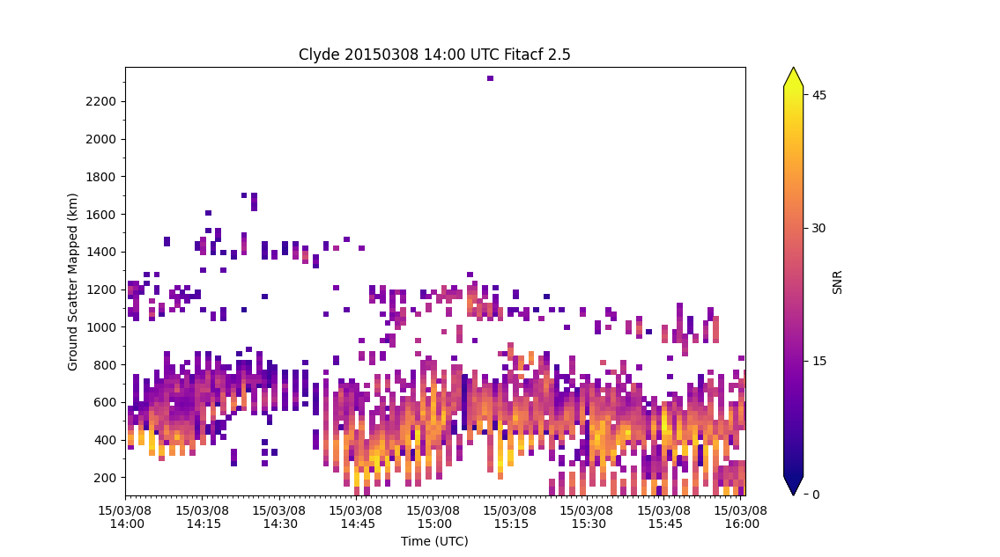
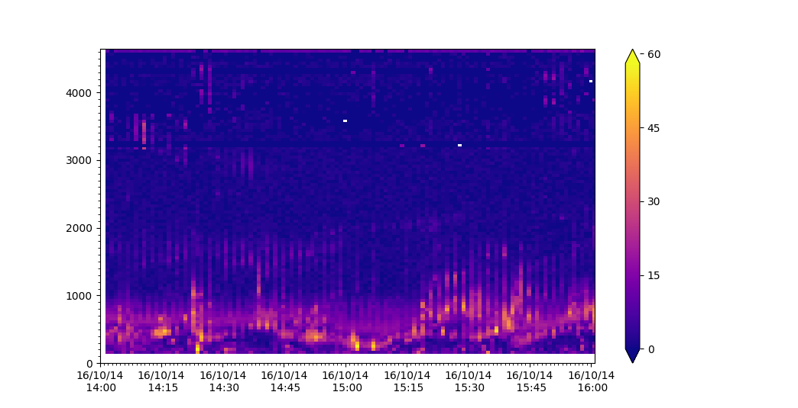
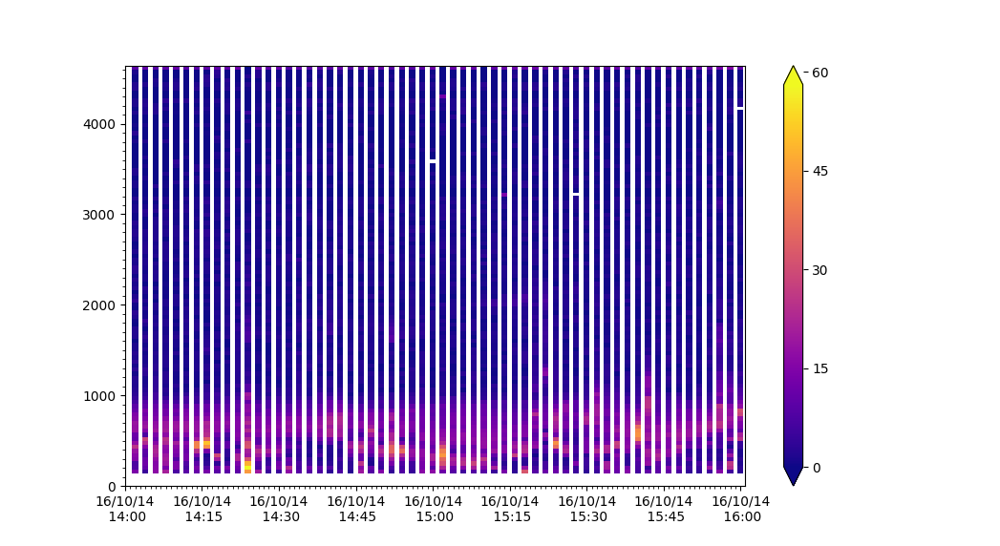
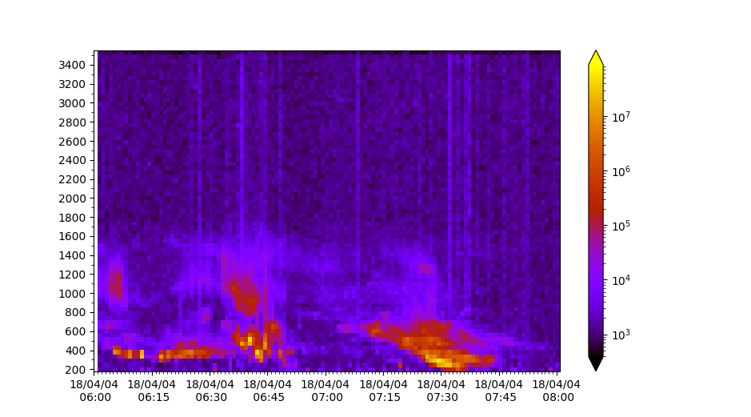

<!--Copyright (C) SuperDARN Canada, University of Saskatchewan 
Author(s): Marina Schmidt 
Modifications:
2020-12-01 Carley Martin updated documentation

Disclaimer:
pyDARN is under the LGPL v3 license found in the root directory LICENSE.md 
Everyone is permitted to copy and distribute verbatim copies of this license 
document, but changing it is not allowed.

This version of the GNU Lesser General Public License incorporates the terms
and conditions of version 3 of the GNU General Public License, supplemented by
the additional permissions listed below.
-->

# Range-Time Parameter Plots 
---

Range-time parameter plots (also known as range-time intensity (RTI) plots) are time series of a radar-measured parameter at all range-gates along a specific beam. They are the most common way to look at data from a single radar. 

### Basic RTP
The general syntax for plot_range_time is:
'plot_range_time(fitacf_data, options)'
where 'fitacf_data' is the read in data, and the options are several python parameters used to control how the plot looks.

First, make sure pyDARN and matplotlib are imported, then read in the .fitacf file with the data you wish to plot:
```python
import matplotlib.pyplot as plt

import pydarn

fitacf_file = "20190831.C0.cly.fitacf"
sdarn_read = pydarn.SuperDARNRead(fitacf_file)
fitacf_data = sdarn_read.read_fitacf()

```

You can choose one of four data products to plot:

| Data product                | String name |
|-----------------------------|-------------|
| Line of sight velocity (m/s)| `v`         |
| Spectral width (m/s)        | `w_l`       |
| Elevation angle (degrees)   | `elv`       |
| Power (dB)                  | `p_l`       |

which is chosen by adding: 

`parameter=String name` 

as an option. The default if left blank is `v`.

To specify which beam to look at, add the option:

`beam=beam_number`

As an example, taking a look at some `v` data from the first record of Clyde River radar FITACF file:
```python
pydarn.RTP.plot_range_time(fitacf_data, beam_num=fitacf_data[0]['bmnum'], range_estimation=pydarn.RangeEstimation.RANGE_GATE)
plt.title("Radar {:d}, Beam {:d}".format(fitacf_data[0]['stid'], fitacf_data[0]['bmnum']))  

plt.show()
```
which produces:


`fitacf_data[0]['bmnum']` is used to extract the beam number of the first (0th) record from the data dictionary, whilst `fitacf_data[0]['stid']` gives the station id (which is 66 for Clyde River).

Notice that the velocity scale on the right is a bit larger than we need, and also ground scatter isn't coloured grey by default. Showing the dates on the x axis is also a bit redundant, because it's data from a single day. Below, there are some additional parameters you can set to address these and more.

In addition, we use `range_estimation=pydarn.RangeEstimation.RANGE_GATE` to set the y-axis to plot in range gates. 
Ground-Scatter Mapped Range is another type of axis you can use with range-time plots:

```python
pydarn.RTP.plot_range_time(fitacf_data, beam_num=3, parameter='p_l',
                           range_estimation=pydarn.RangeEstimation.GSMR,
                           colorbar_label='SNR')
plt.title("Clyde 20150308 14:00 UTC Fitacf 2.5")
plt.ylabel('Ground Scatter Mapped (km)')
plt.xlabel('Time (UTC)')
plt.show()
```




### Additional options
To see all the customisation options, check out all the parameters listed in 'rtp.py'. A few useful ones:

| Parameter                    | Action                                                      |
|------------------------------|-------------------------------------------------------------|
| start_time=(datetime object) | Control the start time of the plot                          |
| end_time=(datetime object)   | Control the end time of the plot                            |
| channel=(int or string)      | Choose which channel to plot. Default is 'all'.             |
| groundscatter=(bool)         | True or false to showing ground scatter as grey             |
| date_fmt=(string)            | How the x-tick labels look. Default is ('%y/%m/%d\n %H:%M') |
| zmin=(int)                   | Minimum data value to be plotted                            |
| zmax=(int)                   | Maximum data value to be plotted                            |
| range_estimation=(RangeEstimation)              | Estaimtion of the distance for the radar to use for the y-axis (See [Ranges, Coords and Projs](coordinates.md)) |
| coords=(Coords)              | Used in conjunction with range_estimation, converts the y-axis to a coordinate |
| lat_or_lon=(str)             | In conjunction with coords, choose if you would like the latitude ('lat') or longitude ('lon') |
| colorbar=(plt.colorbar)      | If you would like a different colorbar than the default     |
| colorbar_label=(str)         | Set the label fo the colorbar                               |

For instance, code for a velocity RTP showing the same beam of Clyde river radar as above, but with ground scatter plotted in grey, date format as `hh:mm`, custom min and max values and a colour bar label could look something like:
```python
pydarn.RTP.plot_range_time(fitacf_data, beam_num=fitacf_data[0]['bmnum'], groundscatter=True,
                           zmax=500, zmin=-500, date_fmt='%H:%M',
                           colorbar_label='Line-of-Sight Velocity (m s$^{-1}$)',
                           range_estimation=pydarn.RangeEstimation.RANGE_GATE)
```
which outputs:

 

and looks much more useful!

Plotting:
```python
pydarn.RTP.plot_range_time(fitacf_data, beam_num=fitacf_data[0]['bmnum'], groundscatter=True,
                           zmax=500, zmin=-500, date_fmt='%H:%M',
                           colorbar_label='Line-of-Sight Velocity (m s$^{-1}$)',
                           range_estimation=pydarn.RangeEstimation.SLANT_RANGE,
                           coords=pydarn.Coords.GEOGRAPHIC, lat_or_lon='lat')
```
will produce the above plot with geographic latitude along the y-axis instead. 

#### Plotting with a custom color map
Because the default parameter plotted is line-of-sight velocity, there is also a special red-blue colour map set as default (as seen above) which is only meant for velocity RTP's. 

To change the colormap, use the 'cmap' parameter with the string name of a matplotlib color map ([found here](https://matplotlib.org/tutorials/colors/colormaps.html)). For example, plotting the power along the beam above using the colormap 'viridis':
```python
pydarn.RTP.plot_range_time(fitacf_data, beam_num=7, parameter='p_l', zmax=50, zmin=0, date_fmt='%H%M', colorbar_label='Power (dB)', range_estimation=pydarn.RangeEstimation.RANGE_GATE, cmap='viridis')
```
produces:


Feel free to choose a color map which is palatable for your needs.

!!! Warning
    If the data contains `-inf` or `inf` a warning will be presented and the following parameters will be defaults to the scale:

| Parameter | Name            | Scale       |
| --------- | --------------- | ----------- |
| `v`       | velocity        | (-200, 200) |
| `p_l`     | Signal to Noise | (0, 45)     |
| `w_l`     | Spectral Width  | (0, 250)    |
| `elv`     | Elevation       | (0, 45)     |

Example:

```python
import pydarn
import pydarnio
import matplotlib.pyplot as plt 

fitacf_file = 'data/20161014.1401.00.rkn.lmfit2'
fitacf_reader = pydarnio.SDarnRead(fitacf_file)
fitacf_data = fitacf_reader.read_fitacf()
pydarn.RTP.plot_range_time(fitacf_data, beam_num=7, parameter='p_l')
plt.show()
```

***console output***

```bash
UserWarning: Warning: zmin is -inf, set zmin to 0. You canset zmin and zmax in the functions options
```



!!! Warning
    When using filters on data you may remove all data or some data which causes a `NoDataError` or stripping in the plot


Example of data looking stripping from filtering setting

```python
filts = {'min_scalar_filter':{'tfreq': 11000}}
pydarn.RTP.plot_range_time(fitacf_data, beam_num=7, parameter='p_l', 
                           filter_settings=filts)
plt.show()
```



### Plotting Lag-0 

Range-time plots also allow users to plot `pwr0` parameters in RAWACF files:

``` python
import pydarn
import matplotlib.pyplot as plt 
from matplotlib import colors

rawacf_file = './data/20180404.0601.00.inv.rawacf'
rawacf_data = pydarn.SuperDARNRead().read_dmap(rawacf_file)
lognorm=colors.LogNorm

pydarn.RTP.plot_range_time(rawacf_data, beam_num=0, parameter='pwr0',
                           norm=lognorm, cmap='gnuplot')
```


